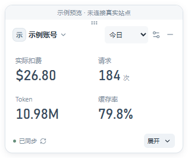
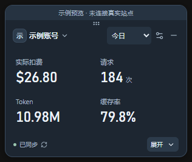

# SubGauge

[](https://github.com/YuVerseX/SubGauge/actions/workflows/windows.yml)

Windows 桌面 Sub2API 个人用量悬浮窗。平时只显示关心的数字，需要时原地展开，或打开详细用量。

通过站点地址、邮箱和密码登录，支持多站点、多账号；普通用户和管理员都查看自己账号下全部 Key 的合计，不要求 API Key。

| 浅色 | 深色 |
| --- | --- |
|  |  |

截图为明确标注的示例预览，未连接真实站点。

## 功能

- 今日、滚动最近 7 天、自然月和最近 N 分钟；实际扣费、请求数、Token、加权缓存率及当前余额。
- 精简常驻卡片，原地展开查看最近请求；详情提供趋势、记录筛选与分页、模型和 Key 分析。
- 账号独立保存指标、顺序、默认范围、时区和最近窗口时长。
- 拖动定位、拖边调整大小、置顶、隐藏到托盘、详情最小化；浅色、深色和跟随系统主题。
- TOTP 流程、会话恢复、用户范围 DPAPI 加密；真实连接失败保留同步状态，不显示模拟数字。

最近 7 天为连续 168 小时，余额始终是当前快照；不额外计算套餐结转，也不合计不同站点的费用。统计完整性与实现上限见 [验证记录](docs/validation.md)。

## 使用与兼容

提供 Windows x64 安装版和免安装 ZIP。安装版运行 `SubGauge_<version>_x64-setup.exe`；免安装版解压后运行 `SubGauge.exe`。两者共享当前 Windows 用户的账号与设置。操作、登录及升级说明见 [使用指南](docs/user-guide.md)。

**下载 0.1.6 预览版：** [安装版](https://github.com/YuVerseX/SubGauge/releases/download/v0.1.6/SubGauge_0.1.6_x64-setup.exe) · [免安装 ZIP](https://github.com/YuVerseX/SubGauge/releases/download/v0.1.6/SubGauge-0.1.6-windows-x64.zip) · [发布说明与 SHA256](https://github.com/YuVerseX/SubGauge/releases/tag/v0.1.6)。

运行需要 WebView2 Runtime。安装版缺少运行时时会联网下载，免安装版需自行准备。当前分发未签名。

当前源码和公开版本为 **0.1.6**，变更与分发信息见 [发布说明](docs/releases/0.1.6.md)。已完成的桌面验收基线为 **0.1.5 / Windows 10 x64 / 150% 显示缩放**；0.1.6 已通过自动回归和打包检查，尚未重做安装升级与原生桌面验收。Windows 11、其他实际系统 DPI、多屏、启用验证码或 TOTP 的真实部署及长期内存稳定性尚未全部验证。

## 从源码运行

技术栈为 Tauri 2、Vue 3、TypeScript 和 Rust。开发需要 Windows x64、Node.js 24、Rust MSVC、C++ Build Tools、Windows SDK 和 WebView2；环境与最低版本说明见 [开发文档](docs/development.md)。

```powershell
npm ci
npm run desktop
```

```powershell
# 类型、布局与详情、Rust 格式、严格 Clippy 与业务回归
npm run verify
# 先构建安装包，再生成免安装 ZIP 和 SHA256
npm run package
npm run package:portable
```

浏览器设计预览：`npm run dev` 后访问 `http://127.0.0.1:1420/?demo=1`。它只使用示例数据，不接收真实登录。

## 项目文档

| 文档 | 内容 |
| --- | --- |
| [产品设计](docs/product-design.md) | 交互、指标及统计口径 |
| [架构说明](docs/implementation-plan.md) | 原生服务、会话、存储与同步 |
| [接入研究](docs/integration-notes.md) | 固定源码版本的权限和接口依据 |
| [开发文档](docs/development.md) | 环境、检查与打包 |
| [验证记录](docs/validation.md) | 已通过、已知限制和未执行项 |
| [验收清单](docs/acceptance-plan.md) | 各类修改的验证条件 |
| [发布流程](docs/releasing.md) | 公开仓库及二进制发布流程 |
| [变更记录](CHANGELOG.md) | 版本行为变化 |

参与开发见 [CONTRIBUTING.md](CONTRIBUTING.md)，安全边界及问题报告见 [SECURITY.md](SECURITY.md)。

## 许可证与来源

SubGauge 采用 [MIT 许可证](LICENSE)。产品研究参考 [sub2api-usage-float](https://github.com/chopperH0824/sub2api-usage-float)，对接 [Sub2API](https://github.com/Wei-Shaw/sub2api) 的个人接口。固定研究版本、第三方许可证和依赖说明见 [来源与致谢](ACKNOWLEDGEMENTS.md)。
